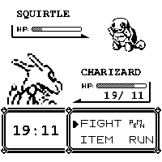
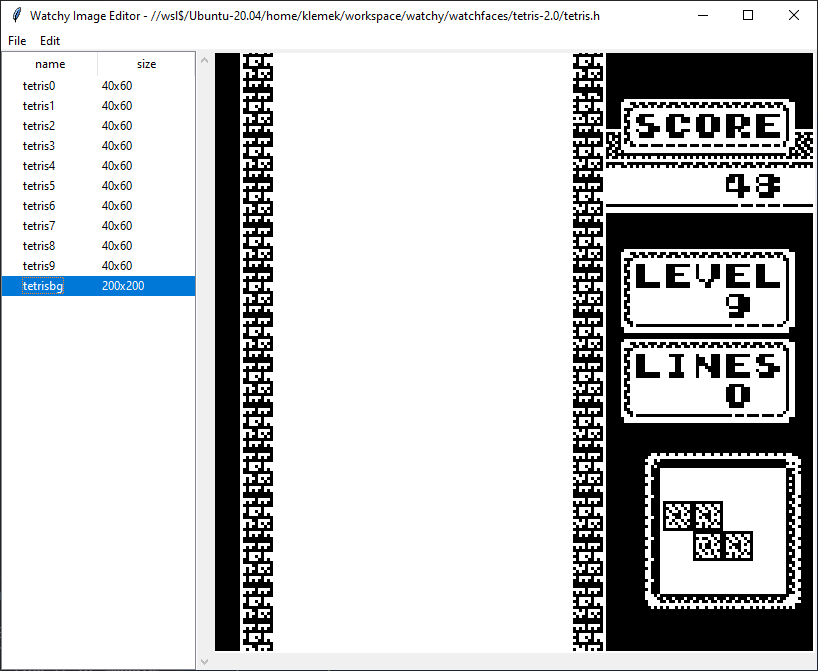

# Klemek's Watchy

## Watchfaces

### Tetris 2.0

A better skin for Tetris!

* "Score" is number of steps
* "Level" is battery level (0 - 100%)
* "Lines" is current date (day + month)
* Digits patterns are not the same depending of the type (first digit of minutes, ...)
* Random piece is drawn on the bottom-right each day (19 unique images)
  * Find any day piece [here](https://klemek.github.io/watchy/)

### Pokemon 2.0

A better skin for Pokemon!

* Wild Pokemon
  * Changes every hour
  * Bar is decreasing in an hour
  * Level is 100 steps
* Owned Pokemon
  * Changes every day
  * Bar is decreasing in a day
  * Level is battery level
  * HP is current datec

### beLow

#### [below.black](https://below.black)

## Tool: Watchy Image Editor (WIP)

Read/Write/Import/Export images from header files

To use : `python3 watchy-image-editor/main.py`

