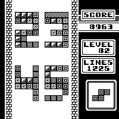

# Klemek's Watchy

## Watchfaces

### Tetris 2.0

A better skin for Tetris!

(before)

(after)

* "Score" is number of steps
* "Level" is battery level (0 - 100%)
* "Lines" is current date (day + month)

## Tool

Meanwhile I'm making an editor for images (WIP) :

To use : `python3 watchy-image-editor/main.py`