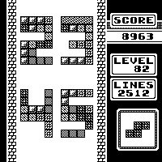

# Tetris 2.0 Watchface

A better skin for Tetris!

* "Score" is number of steps
* "Level" is battery level (0 - 100%)
* "Lines" is current date (day + month)
* Digits patterns are not the same depending of the type (first digit of minutes, ...)
* Random piece is drawn on the bottom-right each day (19 unique images)
  * Find any day piece [here](https://klemek.github.io/watchy/)

> Before -> After

